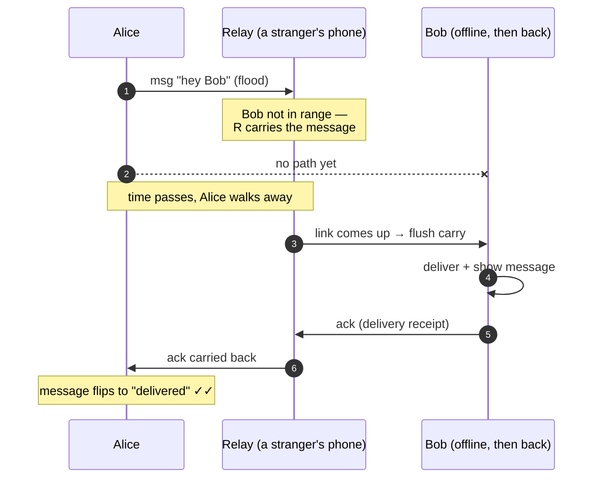
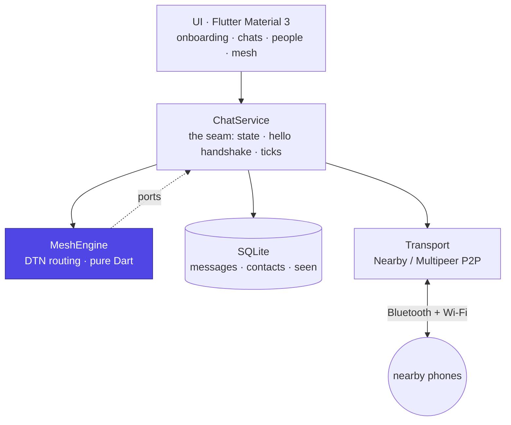

<div align="center">


# studchat


**🇮🇳 Proudly Made in India**

### Chat that works with **no internet, no servers, no SIM.**

Messages hop **phone-to-phone over Bluetooth and Wi-Fi** and are delivered
whenever the other person comes back in range. An offline, serverless mesh
messenger built on a delay-tolerant network with epidemic routing and
end-to-end delivery receipts.

<br/>

[](https://github.com/royalpinto007/studchat/actions/workflows/ci.yml)
[](https://github.com/royalpinto007/studchat/actions/workflows/build-apk.yml)
[](tool/engine_check.dart)
<br/>
[](https://flutter.dev)
[](docs/PLATFORM_SETUP.md)
[](LICENSE)
[](CONTRIBUTING.md)
[](#-made-in-india)

<br/>

**[What it is](#what-it-is) · [How it works](#-how-your-message-travels) · [Architecture](#-architecture) · [Try it](#-try-it) · [Roadmap](#-roadmap) · [Contributing](#-contributing)**

</div>

---

> [!NOTE]
> **Why this exists.** When the network is down or jammed but people are nearby,
> studchat still gets your message through. Dead-zone buildings, basements, exam
> halls, festivals, protests, stadiums, trains, remote areas, roaming with no
> plan. Proximity is available even when the internet is not.

## What it is

studchat is a private **1:1 messenger with no backend at all**. Instead of
routing through a server, your phone forms a peer-to-peer **mesh** with other
phones nearby. A message you send is flooded to everyone in range, **carried
onward** by each device it reaches, and delivered the moment a chain of carriers
connects you to the recipient, even if that is minutes later after you have both
walked away.

It feels like a normal chat app, a contact list, saved history, sent/delivered
receipts, but the transport underneath is a **store-and-forward mesh** rather
than the cloud.

|  | studchat | Normal messenger |
| --- | --- | --- |
| Needs internet / cell data | **No** | Yes |
| Needs a server or account | **No** | Yes |
| Works in a signal dead-zone | **Yes** | No |
| Your data leaves the device | **No** | Yes |
| Delivers to someone offline-then-back | **Yes**, via carriers | No |

## ✨ Features

- 📡 **Truly offline** — Bluetooth + Wi-Fi peer links, zero infrastructure.
- 🕓 **Store-and-forward** — messages wait and ride other phones until delivered.
- ✅ **Delivery receipts** — end-to-end acks, WhatsApp-style ticks you can trust.
- 🔁 **Self-healing routing** — epidemic flooding with idempotent de-duplication.
- 🔒 **Private by default** — no account, no phone number, data stays on-device.
- 📶 **Live mesh view** — watch peers, carried messages, and routing events.
- 🧪 **Provably correct core** — 24 routing invariants verified in plain Dart.
- 🇮🇳 **Made in India** — open source, no foreign backend.

## 📨 How your message travels

Alice sends a message to Bob, who is **out of range**. A relay carries it and
delivers it later, then the receipt makes the return trip the same way.



Every phone applies the **same six rules** to each envelope it sees:

| # | Rule | Why it matters |
|---|------|----------------|
| 1 | **De-dup** by message id | Idempotency; stops loops and flood storms |
| 2 | **Learn** from a `hello` | Builds the contact list from whoever is near |
| 3 | **Deliver** if it is for me | Save, show, and send an `ack` |
| 4 | **Receipt** on an `ack` for me | Flip my message to *delivered* |
| 5 | **Relay + carry** otherwise | Decrement TTL, cache, re-flood; carry onward |
| 6 | **Cap** everything | TTL + max-age + cache size bound battery and storage |

<details>
<summary><b>Why this is interesting (the systems angle)</b></summary>

<br/>

This is a **delay-tolerant network (DTN)** using **epidemic routing with
end-to-end acknowledgements**, the same shape as a durable, at-least-once
message queue, but running across a swarm of phones instead of a datacenter:

- **Idempotency by id** — a message can arrive by many paths but is acted on once.
- **At-least-once delivery** made exactly-once at the edges via de-dup on the id.
- **Persisted de-dup set** — survives restarts, so a reboot cannot re-flood.
- **Bounded resources** — TTL, max-age, and cache-size caps keep a carrier honest.

The whole routing brain is **framework-free Dart** (no Flutter, no radio, no DB),
which is why its behaviour is pinned down by tests that run on a laptop. See
[`docs/ARCHITECTURE.md`](docs/ARCHITECTURE.md).

</details>

## 🧱 Architecture



- **`lib/core/mesh`** — the engine, envelope, config, ports. **Zero framework imports.**
- **`lib/data`** — SQLite persistence + identity; the `seen` set is persisted.
- **`lib/transport`** — `MeshTransport` interface + `flutter_nearby_connections`.
- **`lib/services/chat_service.dart`** — the single source of truth the UI binds to.
- **`lib/ui`** — a polished Material 3 messenger, including a live **Mesh** tab.

## 🚀 Try it

> [!IMPORTANT]
> The mesh needs **two physical phones on the same OS family** (Android⇄Android
> or iOS⇄iOS). Emulators have no real Bluetooth/Wi-Fi radio.

<details open>
<summary><b>Build & run from source</b></summary>

<br/>

```bash
git clone https://github.com/royalpinto007/studchat.git
cd studchat

flutter create . --platforms=android,ios --org dev.studchat  # native shell
flutter pub get
bash tool/patch_nearby_plugin.sh   # modernise the 2021-era mesh plugin
flutter run                        # on a connected device
```

Full platform notes (permissions, minimum SDKs) are in
[`docs/PLATFORM_SETUP.md`](docs/PLATFORM_SETUP.md).

</details>

<details>
<summary><b>Grab a prebuilt APK</b></summary>

<br/>

Every push builds an installable APK. Download the latest from the
[**Build APK** workflow](https://github.com/royalpinto007/studchat/actions/workflows/build-apk.yml)
(open the newest run → **Artifacts** → `studchat-apk`), or from
[Releases](https://github.com/royalpinto007/studchat/releases) once tagged.

</details>

<details>
<summary><b>Verify the routing engine without a phone</b></summary>

<br/>

The store-and-forward core is provable on a laptop with just the Dart SDK:

```bash
dart run tool/engine_check.dart
```

```
── Store-and-forward across time (recipient offline, then returns)
  ✓ nobody delivered yet (C never in range)
  ✓ R is carrying the message for later
  ✓ C finally received it after coming back in range
  ✓ A eventually learns it was delivered
  ...
  24 passed, 0 failed — all mesh-engine invariants hold ✓
```

</details>

## 🧭 Honest constraints

Designed in up front, so nothing surprises you:

- **Cross-platform wall** — one codebase runs on both, but a message cannot hop
  across the OS boundary (Android and iOS use different peer radios). v1 meshes
  within an OS family.
- **Range and density** — delivery needs a chain of carriers to exist. Sparse
  crowds mean slow or no delivery. Inherent to any mesh.
- **Plaintext in v1** — end-to-end encryption is the next milestone, not shipped.
- **Battery** — continuous advertise + scan is not free; duty-cycling is planned.

## 🗺 Roadmap

- [x] Onboarding, live peer discovery, 1:1 text chat
- [x] Store-and-forward with de-dup, TTL, and end-to-end acks
- [x] Persistent history and contacts; resume undelivered on restart
- [x] Live mesh diagnostics view
- [ ] 🔐 End-to-end encryption (per-contact keys) + message signing
- [ ] 👥 Group rooms
- [ ] 🖼 Media over Wi-Fi transport
- [ ] 🔋 Battery duty-cycling
- [ ] 🌉 Online bridge: any node with internet relays onward

## 🇮🇳 Made in India

Built in India, open source, privacy-first. No servers, no foreign backend, no
account: your messages and identity **never leave your device**. studchat is the
kind of resilient, self-reliant tech that works in India's dead-zones, trains,
and crowds, and it belongs to everyone who runs it.

The app carries a tricolour identity and the **Ashoka Chakra**, and an in-app
**"India & studchat"** screen with the **Preamble** and the **Fundamental Duties
(Article 51A)** for civic reference, plus friendly facts about how the mesh
works.

> [!NOTE]
> studchat is an **independent, citizen-built** project. It is **not affiliated
> with or endorsed by** any government or political party. National symbols are
> used respectfully; we deliberately never use the restricted State Emblem (the
> Lion Capital). See [DISCLAIMER.md](DISCLAIMER.md).

**Legal:** [Privacy Policy](PRIVACY.md) · [Terms of Use](TERMS.md) ·
[Disclaimer](DISCLAIMER.md). In v1, messages are **not** end-to-end encrypted,
so please do not send sensitive information yet.

## 🤝 Contributing

Contributions are welcome. Good first steps:

- Read [`CONTRIBUTING.md`](CONTRIBUTING.md) and [`docs/ARCHITECTURE.md`](docs/ARCHITECTURE.md)
- Keep the mesh engine framework-free and add tests for routing changes
- Open an [issue](https://github.com/royalpinto007/studchat/issues/new/choose) or a PR

By participating you agree to the [Code of Conduct](CODE_OF_CONDUCT.md).
Security issues: see [SECURITY.md](SECURITY.md).

## ⭐ Star this project

If studchat is useful or interesting, a star genuinely helps others find it.

<a href="https://github.com/royalpinto007/studchat/stargazers">
  
</a>

Once the project gathers a few stars, a growth chart will render here via
[star-history.com](https://star-history.com/#royalpinto007/studchat&Date).

## 📄 License

[MIT](LICENSE) © royalpinto007
